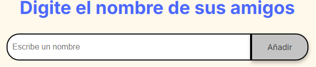
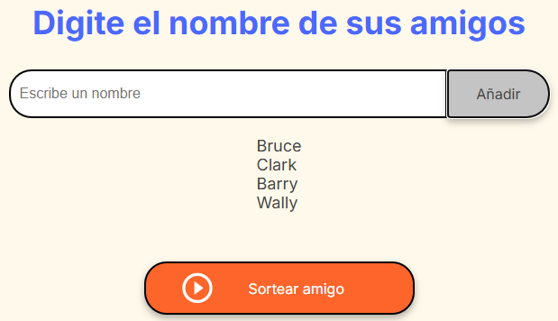
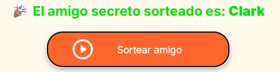

# Amigo invisible

## Funcionalidad del proyecto

Esta aplicación permite organizar de forma sencilla un sorteo de "Amigo Secreto" entre un grupo de personas. A través de una interfaz intuitiva, los usuarios pueden agregar nombres y realizar el sorteo de manera aleatoria.

## Funcionalidades principales:
* Agregar nombres:
Los usuarios pueden escribir el nombre de un amigo en un campo de texto y agregarlo a la lista haciendo clic en el botón "Adicionar".

* Validación de entrada:
Si el campo de texto está vacío al intentar adicionar un nombre, se muestra una alerta solicitando un nombre válido.

* Visualización de la lista:
Todos los nombres agregados se mostrarán en una lista visible en pantalla, permitiendo al usuario verificar quiénes participarán en el sorteo.

* Sorteo aleatorio:
Al hacer clic en el botón "Sortear Amigo", la aplicación selecciona aleatoriamente uno de los nombres ingresados y lo muestra en pantalla como resultado del sorteo.

## Explicacion
### Agregar el nombre de tu amigo, apretar añadir o enter

### Tus amigos apareceran en una lista

### Al apretar "Sortear amigo" aparecera tu amigo invisible

